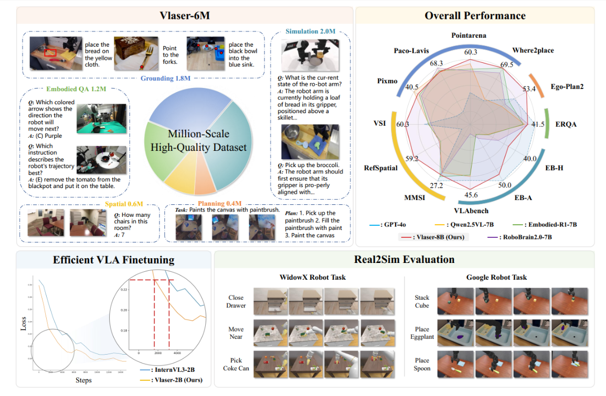
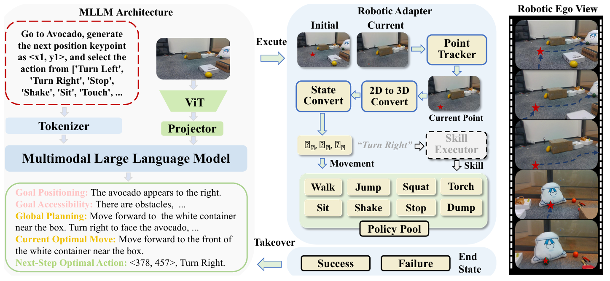
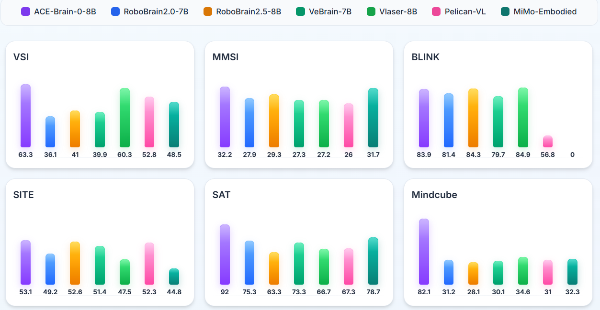
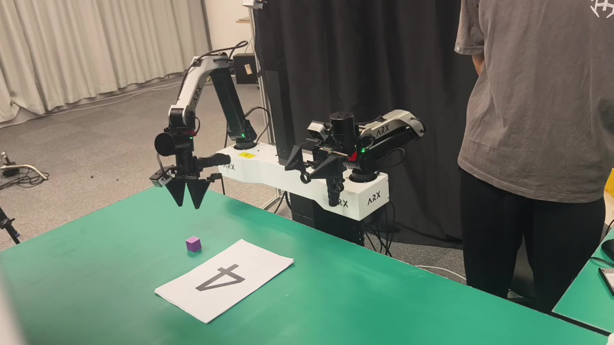
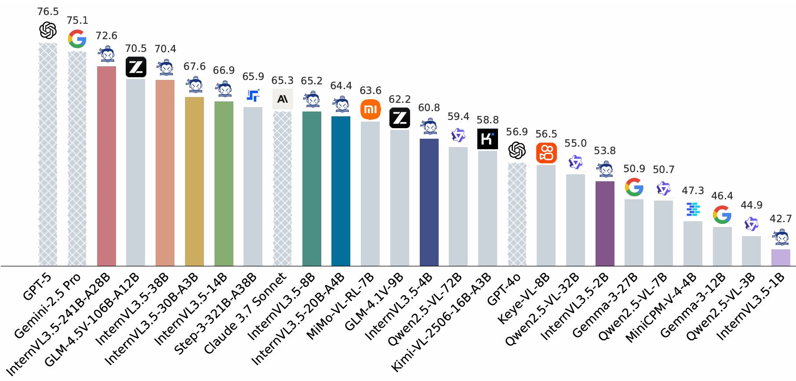
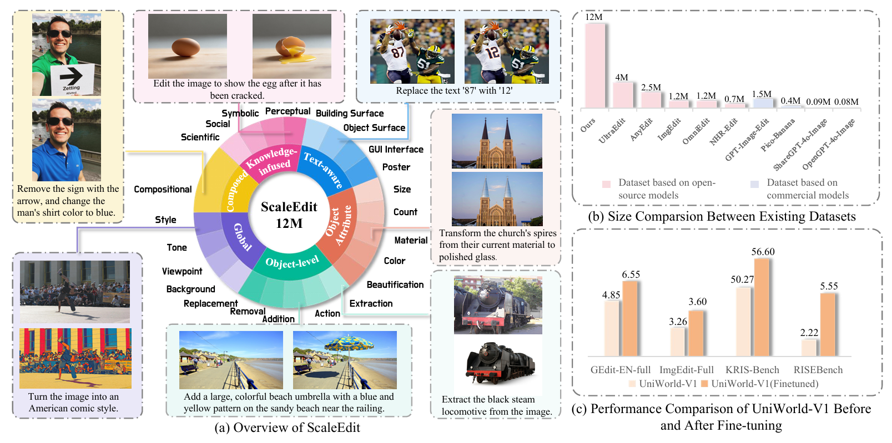
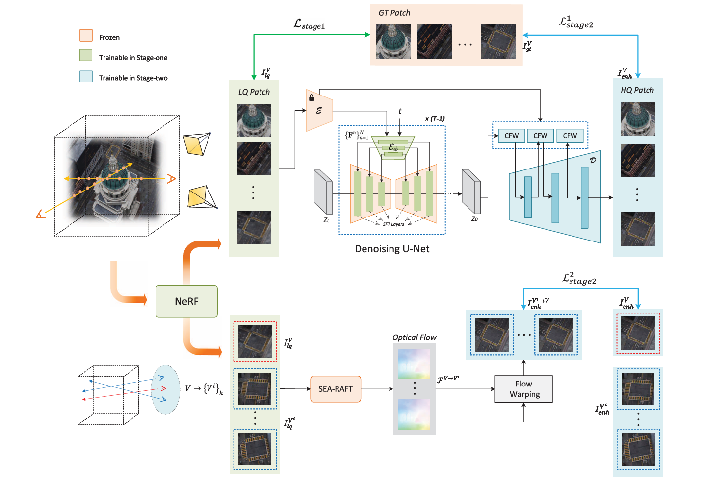
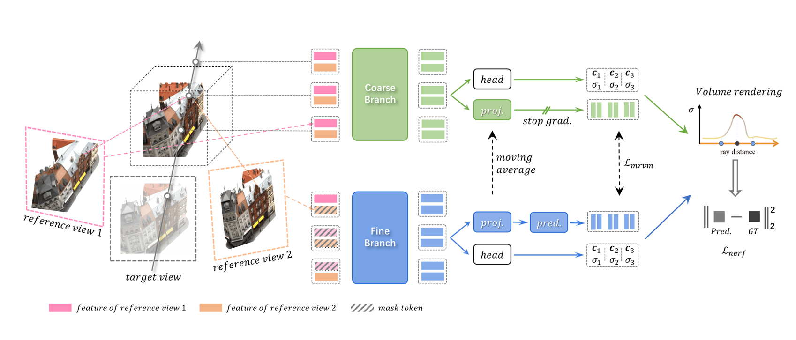

I am Ganlin Yang, a Ph.D. candidate at the University of Science and Technology of China and a joint PHD student at Shanghai AI Laboratory. My primary research interest is **embodied intelligence**, especially at the intersection of **embodied manipulation** and **embodied brain** models. I aim to develop agents that can perceive, reason, and act coherently in long-horizon tasks, with strong generalization across environments, tasks, and embodiments.

My recent work focuses on how multimodal foundation models can support embodied decision-making through unified end-to-end frameworks. Representative projects include [VLASER](https://arxiv.org/abs/2510.11027), [Visual Embodied Brain](https://arxiv.org/abs/2506.00123), and [EventVLA](https://arxiv.org/abs/2606.20092). These works emphasize spatial intelligence, world-model-guided reasoning, and memory-enhanced policy learning for robust long-horizon behavior.

I also work on **multimodal understanding and generation**. I have contributed to the InternVL research line, including [InternVL3.5](https://arxiv.org/abs/2508.18265), [InternVL-U](https://arxiv.org/abs/2603.09877) and [Intern-S1](https://arxiv.org/abs/2508.15763). This line of work explores model capability scaling, multimodal reasoning, and large-scale open data/model pipelines.
Before these directions, I also worked on 3D reconstruction and neural rendering. This experience provides a useful foundation for visual representation learning in embodied systems.
## Education

  

    <i><b>University of Science and Technology of China</b></i>
     P.H.D candidate of Electronic Engineering & Information Science
     School of Information Science and Technology
     Supervisor: Prof. <a href="https://scholar.google.com/citations?hl=zh-CN&user=SH_-B_AAAAAJ">Jifeng Dai</a>, Prof. <a href="https://scholar.google.com/citations?hl=zh-CN&user=8s1JF8YAAAAJ">Wengang Zhou</a>
  

  
<i>Sep. 2024 - Present</i>

  

    <i><b>University of Science and Technology of China</b></i>
     Master of Electronic Engineering & Information Science
     School of Information Science and Technology
     Supervisor: Prof. <a href="https://scholar.google.com/citations?hl=zh-CN&user=lOWByxoAAAAJ">Dong Liu</a>
  

  
<i>Sep. 2022 - Jun. 2024</i>

  

    <i><b>University of Science and Technology of China</b></i>
     Bachelor of Electronic Engineering & Information Science
     School of Gifted Young
     GPA: 3.89/4.3 (ranked 10% at School of Gifted Young)
  

  
<i>Sep. 2018 - Jun. 2022</i>

## Internship

  

    <i><b>Microsoft Research Asia (MSRA)</b></i>
     Research Intern, Intelligent Multimedia Group
     Research Topic: 3D reconstruction and Neural Rendering
     Supervisor: Dr. <a href="https://scholar.google.com/citations?hl=zh-CN&user=X7M0I8kAAAAJ">Zhizheng Zhang</a>  
  

  
<i>August 2021 - July 2022</i>

  

    <i><b>Microsoft Research Asia (MSRA)</b></i>
     Research Intern, Multimedia Computing Group
     Research Topic: 3D reconstruction and generation
     Supervisor: Dr. <a href="https://scholar.google.com/citations?hl=zh-CN&user=w-6C7LkAAAAJ">Jingjing Fu</a>
  

  
<i>July 2023 - June 2024</i>

  

    <i><b>OpenGVLab, Shanghai AI Laboratory</b></i>
     Research Intern, Large Language Model Center
     Research Topic: Multimodal Large Language Model
     Supervisor: Dr. <a href="https://scholar.google.com/citations?hl=zh-CN&user=SH_-B_AAAAAJ">Jifeng Dai</a>, Dr. <a href="https://scholar.google.com/citations?hl=zh-CN&user=WM0OglcAAAAJ">Wenhai Wang</a>
  

  
<i>June 2024 - Nov. 2025</i>

  

    <i><b>OpenRobotLab, Shanghai AI Laboratory</b></i>
     Research Intern, Physical Intelligence Center
     Research Topic: Embodied AI; Vision Language Action Model
     Supervisor: Dr. <a href="https://scholar.google.com/citations?hl=zh-CN&user=ssSfKpAAAAAJ">Jiangmiao Pang</a>, Dr. <a href="https://scholar.google.com/citations?hl=zh-CN&user=JmbbZWIAAAAJ">Tai Wang</a>
  

  
<i>Nov. 2025 - Present</i>

  

    <i><b>Shanghai Jiao Tong University</b></i>
     Visiting Intern, ScaleLab
     Research Topic: Embodied AI; World-action Model
     Supervisor: Dr. <a href="https://scholar.google.com/citations?hl=zh-CN&user=HK4x3fkAAAAJ">Yao Mu</a>
  

  
<i>Jan. 2026 - Present</i>

## Research Experiences

<!-- I organize my publications into three major research lines. Google Scholar: <a href="https://scholar.google.com/citations?hl=zh-CN&user=321C4TQAAAAJ">profile</a>. -->

### Embodied Brain and Manipulation

  

    
  

  

    <h3 style="margin-top: 0; font-size: 18px;">VLASER: Vision-Language-Action Model with Synergistic Embodied Reasoning</h3>
    
<i>ICLR 2026</i> | [<a href="https://arxiv.org/abs/2510.11027">Paper</a>] [<a href="https://github.com/OpenGVLab/Vlaser">GitHub</a>] [<a href="https://internvl.github.io/blog/2025-10-11-Vlaser/">Project Page</a>]

    
<strong>Ganlin Yang*</strong>, Tianyi Zhang*, Haoran Hao*, Weiyun Wang, Yibin Liu, ..., Wenhai Wang, Yao Mu, Zhi Hou

    
Summary: VLASER introduces synergistic embodied reasoning to tightly couple scene understanding, instruction grounding, and action prediction for robust long-horizon manipulation.

  

  

    
  

  

    <h3 style="margin-top: 0; font-size: 18px;">Visual Embodied Brain: Let Multimodal Large Language Models See, Think, and Control in Spaces</h3>
    
<i>Technical Report</i> | [<a href="https://arxiv.org/abs/2506.00123">Paper</a>] [<a href="https://github.com/OpenGVLab/VeBrain">GitHub</a>]

    
Gen Luo*, <strong>Ganlin Yang*</strong>, Ziyang Gong*, Guanzhou Chen*, ..., Yu Qiao, Rongrong Ji, Xizhou Zhu

    
Summary: This work proposes a visual embodied brain paradigm that unifies perception, spatial reasoning, and control planning to improve generality across embodied tasks and environments.

  

  

    
  

  

    <h3 style="margin-top: 0; font-size: 18px;">ACE-Brain-0: Spatial Intelligence as a Shared Scaffold for Universal Embodiments</h3>
    
<i>Technical Report</i> | [<a href="https://arxiv.org/abs/2603.03198">Paper</a>] [<a href="https://github.com/ACE-Brain-Team/ACE-Brain">GitHub</a>] [<a href="https://ace-brain-team.github.io/ACE-Brain-0/">Project Page</a>]

    
Ziyang Gong, Zehang Luo, Anke Tang, Zhe Liu, Shi Fu, Zhi Hou, <strong>Ganlin Yang</strong>, ..., Hengshuang Zhao, Dacheng Tao, Xiaogang Wang

    
Summary: ACE-Brain-0 argues for spatial intelligence as a common abstraction across embodiments, enabling transfer of planning and control priors between heterogeneous robots.

  

  

    
  

  

    <h3 style="margin-top: 0; font-size: 18px;">EventVLA: Event-Driven Visual Evidence Memory for Long-Horizon Vision-Language-Action Policies</h3>
    
<i>Technical Report</i> | [<a href="https://arxiv.org/abs/2606.20092">Paper</a>] [<a href="https://github.com/InternRobotics/EventVLA">GitHub</a>] [<a href="https://ganlin-yang.github.io/EventVLA.github.io/">Project Page</a>]

    
<strong>Ganlin Yang*</strong>, Zhangzheng Tu*, Yuqiang Yang*, Sitong Mao, Junyi Dong, Tianxing Chen, Jiaqi Peng, Jing Xiong, Jiafei Cao, Jifeng Dai, Wengang Zhou, Yao Mu, Tai Wang.

    
Summary: EventVLA introduces event-driven memory updates to preserve key visual evidence during long-horizon interaction, improving temporal consistency and policy robustness.

  

### Multimodal Understanding and Generation

  

    
  

  

    <h3 style="margin-top: 0; font-size: 18px;">InternVL3.5: Advancing Open-Source Multimodal Models in Versatility, Reasoning, and Efficiency</h3>
    
<i>Technical Report</i> | [<a href="https://arxiv.org/abs/2508.18265">Paper</a>] [<a href="https://github.com/OpenGVLab/InternVL/">GitHub</a>] [<a href="https://internvl.github.io/blog/2025-08-26-InternVL-3.5/">Project Page</a>]

    
Weiyun Wang, Zhangwei Gao, Lixin Gu, Hengjun Pu,  ... , <strong>Ganlin Yang</strong>, ... , Kai Chen, Yu Qiao, Wenhai Wang, Gen Luo.

    
Summary: InternVL3.5 systematically improves a unified multimodal model across perception, reasoning, and generation, with better scaling behavior and stronger efficiency-quality trade-offs.

  

  

    
  

  

    <h3 style="margin-top: 0; font-size: 18px;">InternVL-U: Democratizing Unified Multimodal Models for Understanding, Reasoning, Generation and Editing</h3>
    
<i>Technical Report</i> | [<a href="https://arxiv.org/abs/2603.09877">Paper</a>] [<a href="https://github.com/OpenGVLab/InternVL-U">GitHub</a>]

    
Changyao Tian, Danni Yang, Guanzhou Chen, ... , <strong>Ganlin Yang</strong>, ... , Yu Qiao, Kai Chen, Hongjie Zhang.

    
Summary: InternVL-U presents a unified multimodal framework that supports both discriminative and generative tasks in one system, enabling broad capability transfer across modalities.

  

  

    
  

  

    <h3 style="margin-top: 0; font-size: 18px;">Intern-S1: A Scientific Multimodal Foundation Model</h3>
    
<i>Technical Report</i> | [<a href="https://arxiv.org/abs/2508.15763">Paper</a>] [<a href="https://github.com/InternLM/Intern-S1">GitHub</a>]

    
OpenGVLab Team.

    
Summary: Intern-S1 focuses on scientific multimodal understanding with stronger domain-oriented reasoning, aiming to bridge general MLLMs and scientific data-intensive applications.

  

  

    
  

  

    <h3 style="margin-top: 0; font-size: 18px;">ScaleEdit-12M: Scaling Open-Source Image Editing Data Generation via Multi-Agent Framework</h3>
    
<i>Technical Report</i> | [<a href="https://arxiv.org/abs/2603.20644">Paper</a>] [<a href="https://github.com/gzchen4ai/ScaleEdit-12M">GitHub</a>]

    
Guanzhou Chen, Erfei Cui, Changyao Tian, Danni Yang, <strong>Ganlin Yang</strong>, Yu Qiao, Hongsheng Li, Gen Luo, Hongjie Zhang.

    
Summary: ScaleEdit-12M builds a multi-agent data engine to generate large-scale editing instruction data, improving data diversity and controllability for open-source image editing models.

  

### 3D Reconstruction & Rendering

  

    
  

  

    <h3 style="margin-top: 0; font-size: 18px;">Drim-NeRF: Diffusion-Based Restoration for Improving Neural Radiance Fields</h3>
    
<i>TCSVT 2025</i> | [<a href="https://ieeexplore.ieee.org/document/11115135">Paper</a>]

    
<strong>Ganlin Yang</strong>, Kaidong Zhang, Jingjing Fu, Dong Liu.

    
Summary: Drim-NeRF introduces a diffusion-based restoration stage to refine degraded views and improve NeRF reconstruction quality under noisy, low-light, or sparsely sampled conditions.

  

  

    
  

  

    <h3 style="margin-top: 0; font-size: 18px;">Mask-Based Modeling for Neural Radiance Fields</h3>
    
<i>ICLR 2024</i> | [<a href="https://arxiv.org/abs/2304.04962">Paper</a>] [<a href="https://github.com/Ganlin-Yang/MRVM-NeRF/">GitHub</a>]

    
<strong>Ganlin Yang</strong>, Guoqiang Wei, Zhizheng Zhang, Yan Lu, Dong Liu.

    
Summary: This work proposes mask-guided modeling for NeRF training, improving geometry and appearance learning by focusing optimization on informative regions and reducing background-induced artifacts.

  

<!-- ## Honor & Awards

<ul>
<li> 
National Scholarship
 
<i>2024-10</i>
</li>

<li> 
National Scholarship
 
<i>2021-10</i>
</li>

<li> 
 Scholarship of <a href="https://www.gac.com.cn/cn/" title="GuangQi">Guangzhou Automobile Group Co., Ltd</a>
 
<i>2020-10</i>
</li>
<li> 
National Scholarship
 
<i>2019-10</i>
</li>
<li> 
The first prize of the <a href="https://www.caa.org.cn/Content/260.html" title="zhinengche">National University Students Intelligent Car Race</a> 
 
<i>2020-08</i>
</li>
<li> 
Meritorious Winner of  <a href="https://www.comap.com/contests/mcm-icm" title="zhinengche">Interdisciplinary Contest In Modeling (ICM)</a> 
 
<i>2021-03</i>
 </li>
</ul> -->

## Skills

**Programming:**

Python, MATLAB, C/C++, PyTorch, LaTeX, Linux, Git, Deepspeed, Distributed Training, High-speed Model Inference

**Research Skills:**

3D Reconstruction and Perception, Multimodal Large Models Understanding and Generation, Reinforcement Learning for Embodied Control, Vision-Language-Action (VLA), World Action Model (WAM), Real-robot Deployment and Evaluation, End-to-end Embodied AI System Integration

